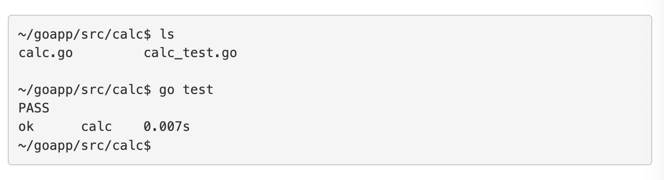

### Go에서 테스트 작성하기 

Go는 간편하게 사용할 수 있는 테스트 프레임워크를 내장하고 있는데 "go test" 명령을 실행하여
테스트 코드들을 실행할 수 있다. "go test"는 현재 폴더에 있는 *_test.go 파일들을 테스트 코드로
인식하고, 이들을 일괄적으로 실행한다. 

테스트 파일은 "testing" 이라는 표준 패키지를 사용한다. 

테스트 메서드는 TestXxx 와 같은 특별한 메서드명을 갖는데, 앞의 Test는 해당 메서드가 
테스트 메서드임을 알리는 것이고 Xxx는 임의의 메서드 명으로 처음 글자는 항상 대문자이어야 한다

메서드의 ProtoType은 아래와 같이 testing.T포인터를 하나 입력으로 받으며 출력은 없다.
테스트 에러를 표시하기 위해 testing.T의 Error() 메서드를 사용한다.

```go
package calc

func Sum(a ...int) int {
    sum := 0
    for _, i := range a {
        sum += i
    }
    return sum
}
```

```go
package calc_test

import (
    "calc"
    "testing"
)

func TestSum(t *testing.T) {
    r := calc.Sum(1, 2, 3, 4, 5)
    if r != 15 {
        t.Error("Wrong result")
    }
}
```



